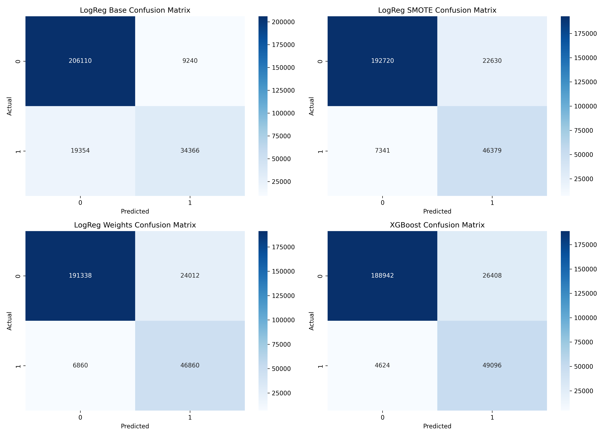
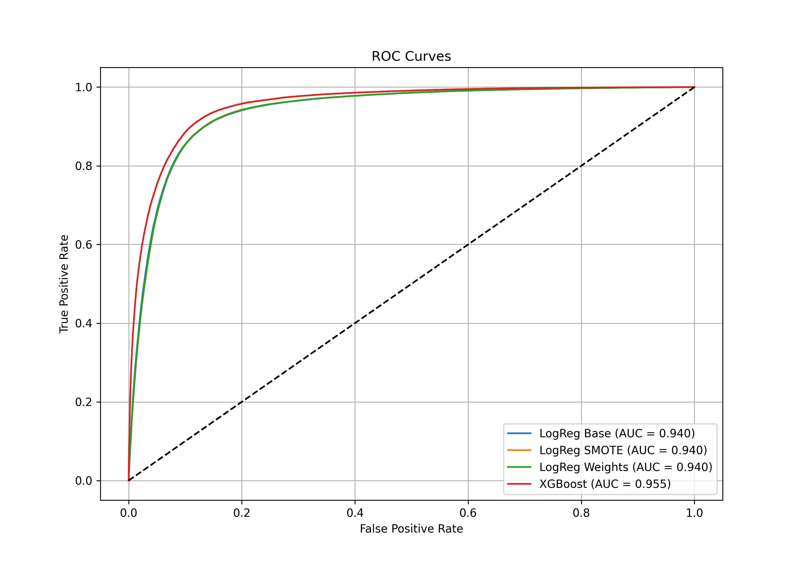
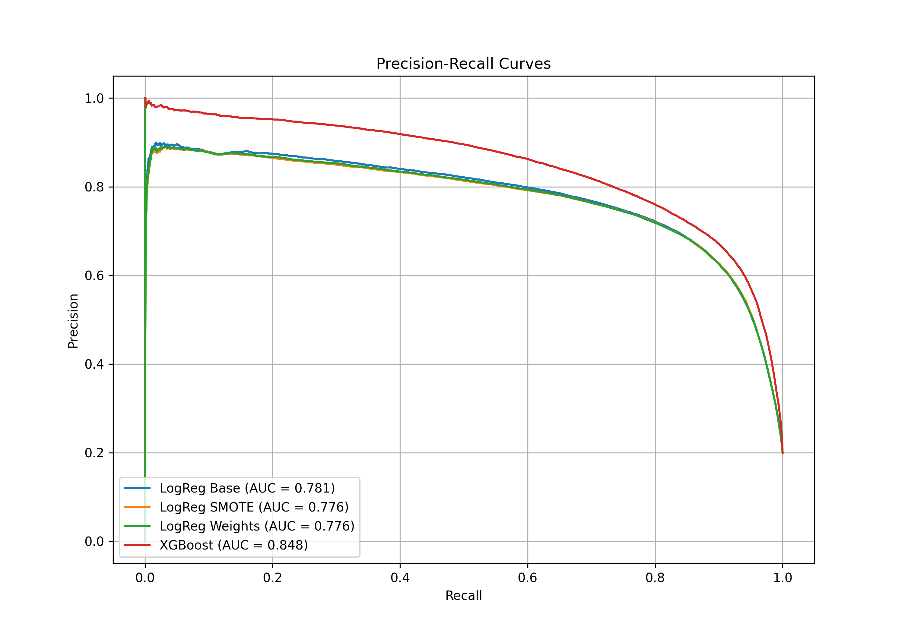
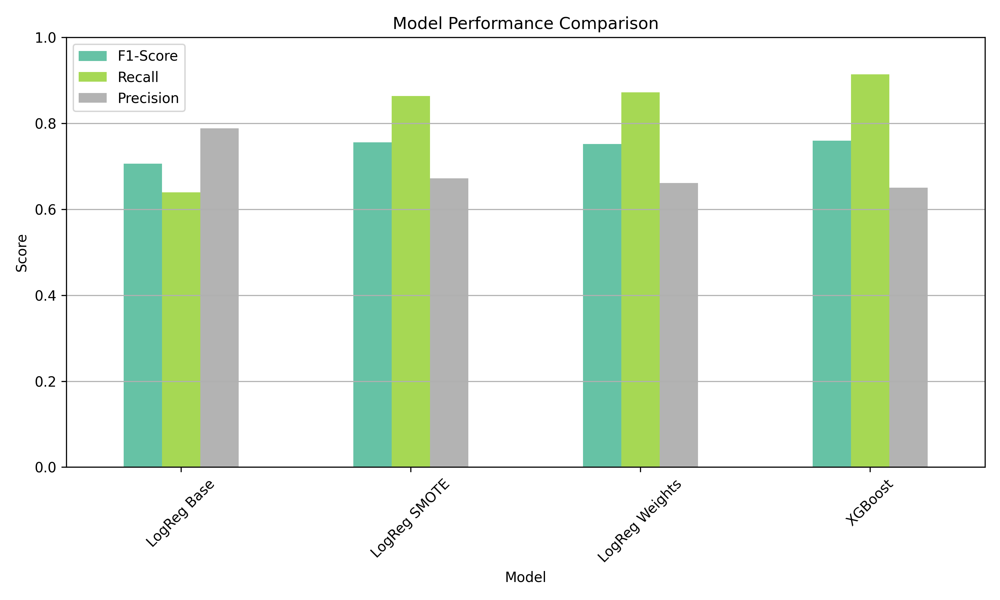

# AI-Driven-Credit-Risk-Prediction-and-Crisis-Resilience-Analysis (Logistic Regression + XGBoost + SHAP)

Predicting whether a loan applicant is likely to default using real-world financial data from LendingClub.

---

## Project Objective

The goal is to develop robust machine learning models to predict **loan defaults**, enabling lenders to:

- Minimize credit risk exposure
- Improve underwriting decisions
- Optimize expected credit loss (ECL) under Basel II/III
- Ensure explainability for compliance and audit purposes

---

## Dataset

- **Source**: LendingClub public loan data
- **Size**: ~2.6 million rows, 100+ features
- **Target Variable**: `loan_default` (1 = defaulted, 0 = non-defaulted)

---

## ML Pipeline

1. **Data Cleaning + Imputation**
2. **EDA** (FICO Score, Annual Income, DTI, Grade, etc.)
3. **Feature Engineering**
4. **Class Imbalance Handling**:
   - SMOTE (Synthetic Minority Oversampling)
   - Class Weights
5. **Modeling**:
   - Logistic Regression (base, SMOTE, weights)
   - XGBoost
6. **Evaluation**:
   - Accuracy, Recall, Precision, F1-Score
   - ROC Curve
   - Confusion Matrix
7. **Model Explainability**:
   - Logistic Coefficients
   - SHAP values (XGBoost)

---

## Visual Results

### 1️⃣ Confusion Matrices

---

### 2️⃣ ROC Curves

---

### 3️⃣ Precision-Recall Curves

---

### 4️⃣ Model Metrics Bar Plot

---

## Insights & Interpretation

| Model              | Accuracy | Recall (Defaulters) | Precision | ROC-AUC | Best For |
|-------------------|----------|---------------------|-----------|---------|----------|
| Logistic (Base)    | 89%      | 64%                 | 79%       | 0.94    | High precision use cases |
| Logistic (SMOTE)   | 89%      | 86%                 | 67%       | 0.94    | Balanced risk detection |
| Logistic (Weights) | 89%      | 87%                 | 66%       | 0.94    | Audit-safe, interpretable |
| **XGBoost**        | 88%      | **91%**             | 65%       | **0.955** | Best risk capture & financial modeling ✅ |

- **SHAP Interpretation**:  
  Key features affecting default probability include:
  - `last_fico_range_high`
  - `last_fico_range_low`, `dti`
  - `term_60_months`, `int_rate`, `mo_sin_old_rev_tl_op`

---

##  Financial Relevance

- **Fits Basel IRB Models** for capital requirement calculation
- **Probabilities of Default (PD)** from models feed into:
  - Expected Credit Loss (ECL)
  - Risk-Based Pricing
  - Loan approval workflows
